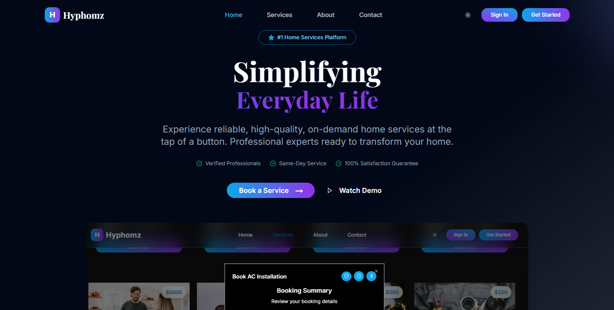

# Hyphomz

## 📌 Project Overview

🏡 About Hyphomz

Hyphomz is a modern web platform offering reliable, high-quality, on-demand home services at the tap of a button. From cleaning and plumbing to repairs and installations, Hyphomz connects you with trusted professionals ready to transform your home — quickly, efficiently, and securely.

## 🖼️  Preview



## 🚀 Features

- **User-friendly interface** for seamless feedback submission
- **Service Booking & Management** Schedule cleaning, plumbing, electrical, pest control, and more — with flexible date & time slots.
- **Search & Discovery** Find services organized into categories like Cleaning, Repairs, Appliances, Beauty, etc.
- **Mobile-responsive design** ensuring accessibility across devices
- **Optimized performance** with server-side rendering (SSR) and static site generation (SSG)
- **Modern UI** powered by Tailwind CSS and Shadcn, magicui

## 🔗 Live Demo

Check out the live version of Hyphomz here: [Live Site](https://hyphomz-nine.vercel.app/)

## 🛠 Installation & Setup

To set up and run the project locally, follow these steps:

### Prerequisites

Ensure you have the following installed:

- **Node.js** (Latest LTS version recommended)
- **npm** or **yarn** for package management

### Steps to Run

1. **Clone the repository:**
   ```sh
   git clone https://github.com/Sankalp20Tiwari/hyphomz.git
   ```
2. **Navigate to the project directory:**
   ```sh
   cd hyphomz
   ```
3. **Install dependencies:**
   ```sh
   npm install --legacy-peer-deps # or yarn install
   ```

4. **Run the development server:**
   ```sh
   npm run dev  # or yarn dev
   ```
5. Open `http://localhost:3000` in your browser to view the application.


## 📂 Project Structure

```
hyphomz/               
   ├──app/             
       ├──(auth)/      # Auth related pages
       ├──about/       # About page
       ├──components/  # Reusable custom made components
       ├──contact/     # Contact page    
       ├──services/    # Services page    
       ├──globals.css  # Custom css styles    
       ├──layout.tsx   # Layout page
       ├──page.tsx     # Actual Landing Page
   ├──components/      # Reusable UI components from shadcn and magicui
   ├──data/            # Data used at various places
   ├──lib              # Utilities         
   ├── public/            # Static assets (images, icons, etc.)
   ├── next.config.ts     # Next.js configuration settings
   ├── package.json       # Project metadata and dependencies
```

## 🏰 Technologies Used

- **Next.js** - React framework for SSR & SSG
- **TypeScript** - Ensures type safety and scalability
- **Tailwind CSS** - Utility-first CSS framework for rapid styling
- **ESLint & Prettier** - Code linting and formatting for better maintainability
- **Shadcn** - Responsive and clean UI with help of Shadcn
- **Framer Motion** - Animations


## 🤝 Contributing

We welcome contributions to enhance the project! To contribute:

1. Fork the repository.
2. Create a new branch (`feature/your-feature-name`).
3. Implement your changes and commit.
4. Push to your forked repository and submit a pull request.


